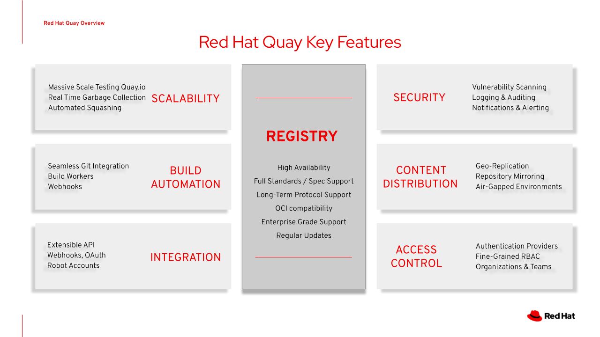

## Welcome to the Red Hat Quay Container Registry demo walkthrough page!

**This is not an official Red Hat product demo. For the official product resources, please see [Red Hat Quay](https://access.redhat.com/products/red-hat-quay)**

This developer-focused walkthrough provides a simple guide for using the Red Hat Quay Container Registry when working with containerized applications. The walkthrough will not cover the Red Hat Quay installation and configuration process. For more information on Red Hat Quay installation, please see [Batteries-Included Quay Install on Red Hat OpenShift](https://www.youtube.com/watch?v=1_6jLGF5ByE)

For this walkthrough, we assume that our users have access to a pre-provisioned instance of Quay, have cloned our [demo code](https://github.com/adnan-drina/quay-demo), and can successfully execute the [setup scripts](00-setup-demo-environment.md).
### Red Hat Quay: A private container registry for distributed, secure development

Red Hat Quay is a private container registry that stores, builds, and deploys container images. It analyzes your images for security vulnerabilities, identifying potential issues that can help you mitigate security risks. Additionally, it delivers georeplication and BitTorrent distribution to increase performance across distributed development sites and increase resiliency and redundancy for disaster recovery.



[//]: # (Red Hat Quay key features:)

[//]: # (- SCALABILITY: Quay is designed according to Microservices architecture and is massively scalable.)

[//]: # (- SECURITY: Quay supports scanning container images for known vulnerabilities and comes with components such as logging, auditing, notifications and alerting.)

[//]: # (- BUILD AUTOMATION: Quay supports building Dockerfiles using a set of worker nodes and, with the use of build triggers, such as GitHub webhooks, it can automatically build new container image versions.)

[//]: # (- CONTENT DISTRIBUTION: Quay supports replication of your images across geographies bringing content closer to the users and maximizing pull performance.)

[//]: # (- INTEGRATION: Quay supports a list of features that allow tight integration with the rest of the operational landscape.)

[//]: # (- ACCESS CONTROL: Quay supports rich Access Control with fine-grade RBAC, Organizations and Teams. It also can be integrated with different Authentication Providers.)

Our walkthrough will cover some of the features developers use when working with containers. We'll learn how to:

1. [Build your first container image and store it in the registry](01-build-your-first-container-image.md)
2. [Scan your container image for vulnerabilities](02-scan-your-container-image-for-vulnerabilities.md)
3. [Mirror container images from external sources](03-mirror-container-images-from-external-sources.md)
4. [Distribute your application using Helm](04-distribute-your-application-using-Helm.md)

But before diving deeper into these topics, we must set up our environment first.

### Setup demo environment

Before we can work on our walkthrough demos, we'll have to configure a few things. The complete setup process is scripted using a very basic bash script. All you have to do is clone our GitHub repo, login to your OpenShift cluster with a fresh running instance of Quay and run this script.

```
$ oc login
$ git clone https://github.com/adnan-drina/quay-demo.git
$ cd quay-demo
$ ./0-setup-env.sh
```

The [0-setup-env.sh](./0-setup-env.sh) script will create a Quay demo user, all needed repositories and accounts used during the walkthrough. All user details are stored in ~/.quay-demo.env and sourced before each step in our walkthrough.
